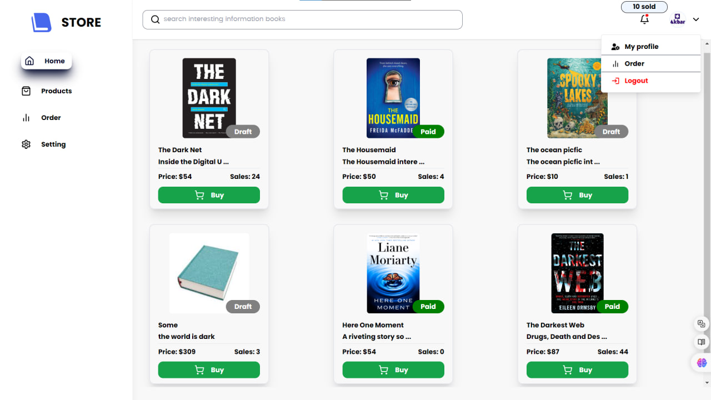
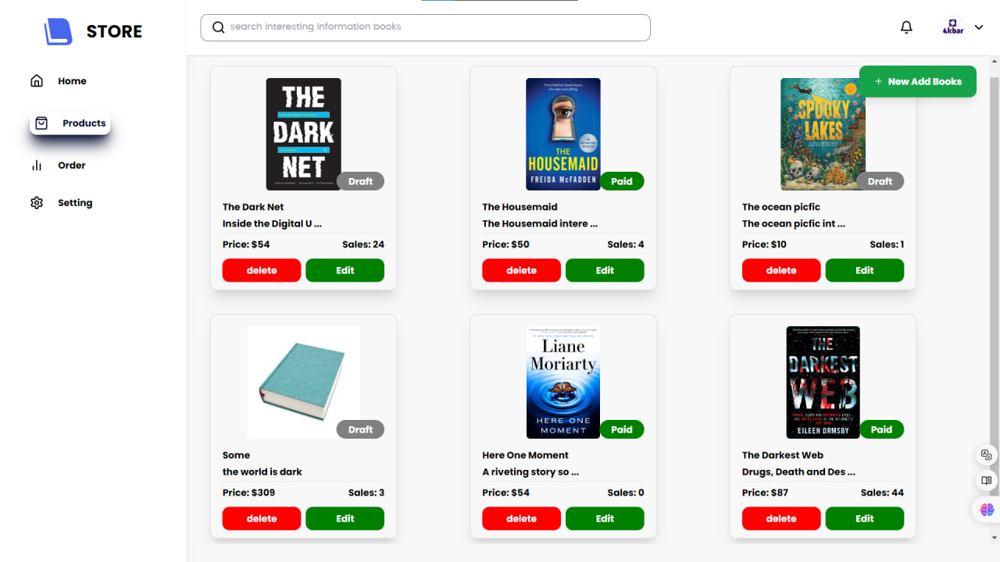
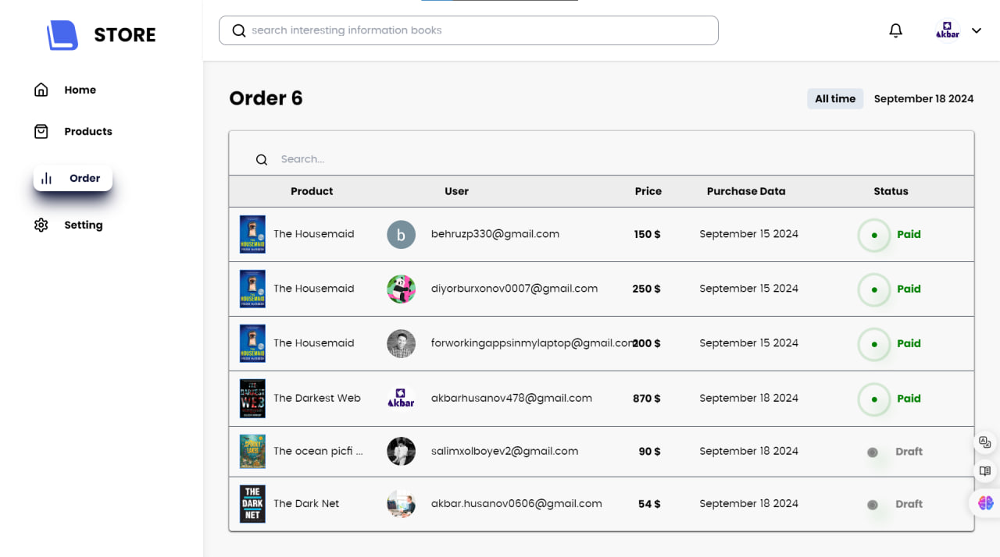

# Dashboard for a Book Shop

A dashboard for a book shop is a tool designed to monitor and manage the operations of the book shop. This panel typically includes the following key functions:

1️⃣ **Sales Data**:  
Information on daily, weekly, and monthly sales volume, the best-selling books, and the number of customers.

2️⃣ **Inventory Management**:  
Information on the number of books in stock, newly arrived books, and books in reserve.

3️⃣ **Customer Data**:  
Purchase history of customers, the most active customers, and customer feedback.

4️⃣ **Financial Metrics**:  
Revenue and expenses, profit margin, and other financial indicators.

5️⃣ **Marketing Campaigns**:  
Current and past marketing campaigns, their effectiveness, and planned future campaigns.

✍️ **Note**:  
Please visit this site using the desktop version. ❌

[🔗 **Source code on GitHub**](https://github.com/Akbar2008/Book-shop-dashboard)

[🔗 **Site link**](https://book-shop-dashboard.vercel.app/)
   
[📢 **Akbar blog uz**](https://t.me/Akbar_muhandis)
